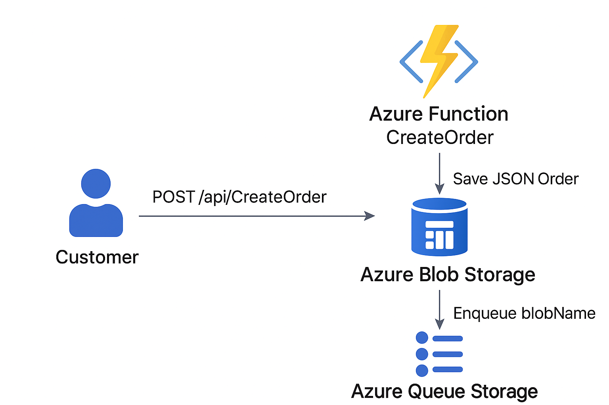

# MapleCart – Serverless E-Commerce Demo

This repository contains the **MapleCart demo application** built to showcase how a small e‑commerce team can move from a single VM to a scalable, reliable, and modern serverless pipeline on Azure. It’s based on the [LinkedIn case study post](#https://lnkd.in/p/ezy5PDyX) about preventing \$1,000,000 in potential sales losses.

The project has two parts:

* **Frontend** (React app + IaC)
* **Backend** (Azure Functions API)

---
📺 **Watch the Demo Video on YouTube** → [https://youtu.be/aDXKJD3JWSY](https://youtu.be/aDXKJD3JWSY)


## 📂 Project Structure

```
maplecart/
├── backend/         # Azure Functions (order API + processing)
├── frontend/        # React frontend + IaC
│   ├── src/services/orderService.js  # Function URL configured here
│   ├── IaC/   # Infrastructure as Code (IaC)
│       ├── main.bicep 
│       └── parameters.json
```

---

## 🛠️ Prerequisites

* [Azure CLI](https://learn.microsoft.com/cli/azure/install-azure-cli)
* [Bicep CLI](https://learn.microsoft.com/azure/azure-resource-manager/bicep/install)
* [Node.js 20](https://nodejs.org/en/) (use `nvm` if possible)
* [Azure Functions Core Tools](https://learn.microsoft.com/azure/azure-functions/functions-run-local)
* An active Azure subscription

---

## ⚙️ Infrastructure Setup

1. **Create a Resource Group manually**

   ```bash
   az group create -n maplecart-rg -l eastus
   ```

2. **Deploy resources with Bicep**

   ```bash
   az deployment group create \
     --resource-group maplecart-rg \
     --template-file frontend/main.bicep \
     --parameters frontend/parameters.json
   ```

   Resources provisioned:

   * Storage Account
   * Azure SQL Database
   * App Service Plan + Function App
   * Application Insights

3. **Switch SQL authentication**

   * Start with **username/password** (simpler for setup).
   * Migrate to **Azure AD authentication** after initial testing.

---

## 💻 Frontend Setup

1. Go into the frontend folder:

   ```bash
   cd frontend
   npm install
   npm run dev
   ```

2. Update the **Function URL** in `src/services/orderService.js`:

   ```js
   // src/services/orderService.js
   const API_URL = "https://<your-function-app>.azurewebsites.net/api/CreateOrder";
   ```

   This ensures orders placed on the website go to the deployed Function.

---

## ⚙️ Backend Setup

1. Go into the backend folder:

   ```bash
   cd backend
   npm install
   ```

2. Configure **local.settings.json**:

   ```json
   {
     "IsEncrypted": false,
     "Values": {
       "AzureWebJobsStorage": "<storage-connection-string>",
       "SQL_SERVER": "<sql-server-name>.database.windows.net",
       "SQL_DATABASE": "maplecartdb",
       "SQL_USER": "<username>",
       "SQL_PASSWORD": "<password>",
       "FUNCTIONS_WORKER_RUNTIME": "node"
     }
   }
   ```

3. Run Functions locally:

   ```bash
   npm start
   ```

   Endpoint exposed:

   * **POST** `/api/CreateOrder` → Save order → Blob Storage + SQL

---
## 🛠️ Architecture (Phase 1)


## 🔗 End-to-End Flow

1. User places an order on the **frontend website**.
2. The frontend calls the deployed **Azure Function** (`CreateOrder`).
3. The Function writes the order JSON to **Blob Storage**.
4. The Function inserts the order into **SQL Database**.
5. Orders are visible both in storage and in the database.

---

## 📊 Monitoring

* **Application Insights**: logs, errors, performance metrics.
* **Storage Explorer**: view blobs.
* **SQL Query Editor**: query inserted orders.

---

## ✅ Quick Start

```bash
# 1. Deploy infra
az group create -n maplecart-rg -l eastus
az deployment group create --resource-group maplecart-rg --template-file frontend/main.bicep --parameters frontend/parameters.json

# 2. Run frontend
cd frontend && npm install && npm run dev

# 3. Run backend
cd backend && npm install && npm start
```

Open the frontend → place an order → check Blob Storage and SQL Database 🎉

---

## Closing Thoughts

This demo shows how a tiny team can:

* Use **Bicep IaC** for repeatable deployments.
* Run a **React frontend** against a **serverless backend**.
* Leverage **Azure SQL** + **Blob Storage** for reliable persistence.
* Add **monitoring and email notifications** with almost no ops overhead.

This is the exact approach that helped MapleCart recover fast during a production incident — and it’s a pattern you can copy for your own projects.
