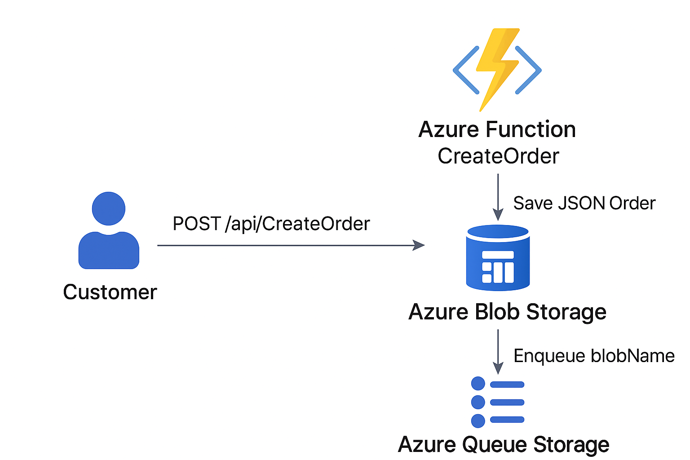

## 📘 Phase 1 README – Core Order Pipeline

# MapleCart – Phase 1: Core Serverless Order Pipeline

This phase sets up the **minimum viable serverless architecture** for processing e-commerce orders on Azure.  

---

## 🏗️ Architecture

**Flow:**
1. User places order in the React frontend.
2. `CreateOrder` (HTTP Function):
   - Saves order JSON → **Blob Storage**.
   - Inserts order row → **SQL Database**.
3. Orders can be queried from SQL or viewed in Storage Explorer.



---

## ⚙️ Deployment Steps

1. **Create Resource Group**
```bash
az group create -n maplecart-rg -l canadacentral
````

2. **Deploy Bicep Infrastructure**

```bash
az deployment group create \
  --resource-group maplecart-rg \
  --template-file ../frontend/IaC/main.bicep \
  --parameters ../frontend/IaC/parameters.json
```

Provisioned:

* Storage Account + Blob container `orders`
* Azure SQL Server + `OrdersDb`
* Function App + Consumption Plan
* Application Insights

3. **Bootstrap SQL in Azure Data Studio**

```sql
CREATE TABLE dbo.Orders (
  OrderId NVARCHAR(50) PRIMARY KEY,
  Item NVARCHAR(100),
  Quantity INT,
  Price DECIMAL(10,2),
  Total DECIMAL(10,2),
  Email NVARCHAR(100),
  FirstName NVARCHAR(50),
  LastName NVARCHAR(50),
  Address NVARCHAR(200),
  City NVARCHAR(100),
  ZipCode NVARCHAR(20),
  OrderDate DATETIME2 DEFAULT (SYSUTCDATETIME())
);
```

4. **Run Functions Locally**

```bash
cd backend
npm install
npm start
```

Endpoint:

```http
POST http://localhost:7071/api/CreateOrder
```

---

## ✅ Testing

* Place an order from the frontend.
* Verify:

  * Blob container `orders` contains an `ORDER-xxxx.json`.
  * SQL table `dbo.Orders` contains the new row.

---

## 🎯 Outcome

Phase 1 proves a small team can:

* Replace a VM with serverless building blocks.
* Persist orders reliably with **Blob + SQL**.
* Deploy fully reproducible infra with **Bicep**.

````

